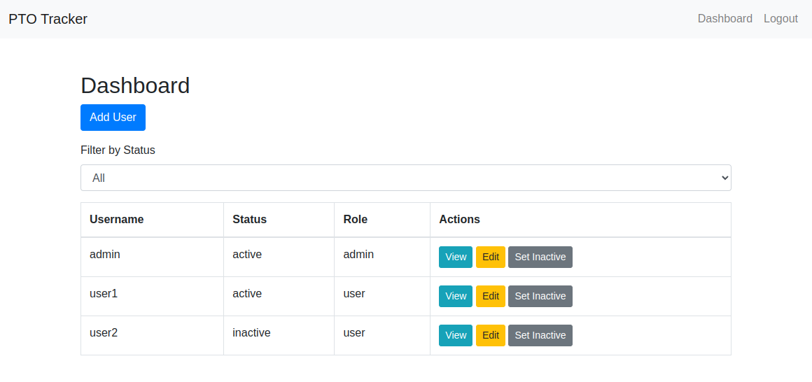
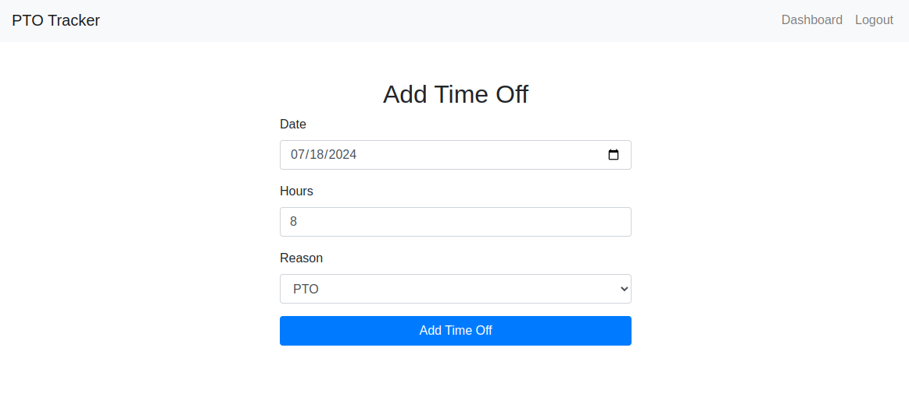
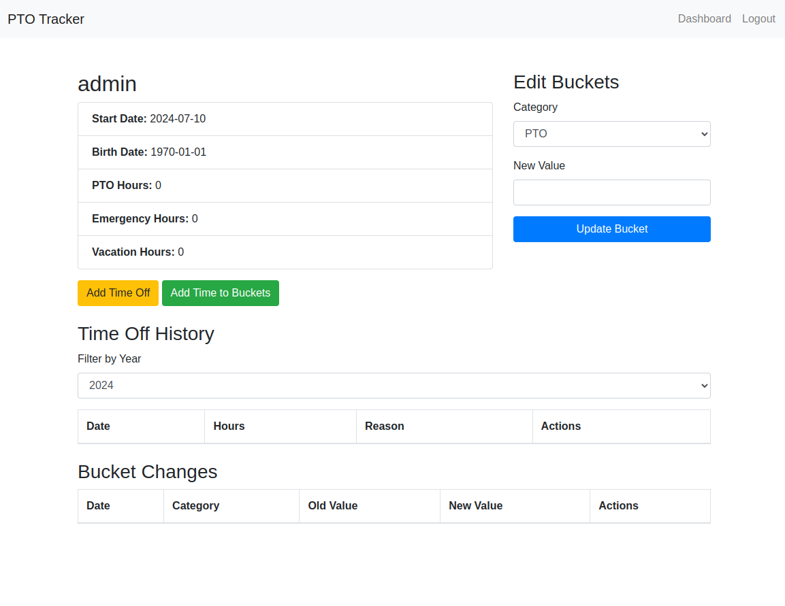
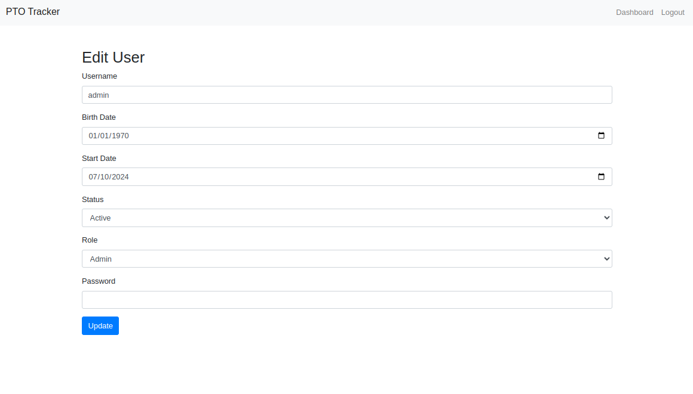
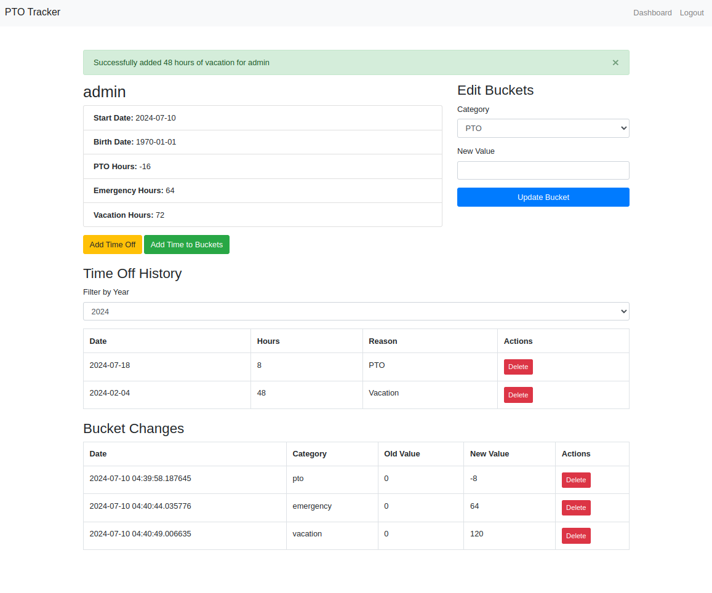

# PTO Tracker Application

## Overview

The PTO Tracker is a web application designed to help organizations manage employee paid time off (PTO), emergency hours, and vacation hours. The application allows administrators to add users, edit user details, manage time off requests, and keep track of the available and used hours for each user.

## Features

- **User Management**: Add, edit, and delete users.
- **Time Off Management**: Record and manage PTO, emergency, and vacation hours.
- **Bucket Changes**: Track changes in the available hours for each category.
- **User Roles**: Differentiate between admin and regular user functionalities.
- **Reporting**: View detailed reports of time off and bucket changes.

## Installation

### Prerequisites

- Python 3.10 or higher
- `pip` (Python package installer)
- `virtualenv` (Python virtual environment tool)
- SQLite (included with Python)

### Steps

1. **Clone the repository**:
    ```sh
    git clone https://github.com/yourusername/pto-tracker.git
    cd pto-tracker
    ```

2. **Create a virtual environment**:
    ```sh
    python -m venv venv
    ```

3. **Activate the virtual environment**:
    - On Windows:
        ```sh
        venv\Scripts\activate
        ```
    - On Unix or MacOS:
        ```sh
        source venv/bin/activate
        ```

4. **Install the required packages**:
    ```sh
    pip install -r requirements.txt
    ```

5. **Set up the database**:
    ```sh
    flask db init
    flask db migrate -m "Initial migration."
    flask db upgrade
    ```

6. **Run the application**:
    ```sh
    flask run
    ```

## Usage

### Accessing the Dashboard

1. **Login**: Use the credentials provided by the administrator to log in to the application.
2. **Dashboard**: The dashboard provides an overview of all users and their respective PTO, emergency, and vacation hours.


### Managing Time Off

1. **Add Time Off**: To add time off for a user, navigate to the "Add Time Off" page.


2. **View User Details**: Click on a user's name in the dashboard to view detailed information about their time off and bucket changes.


### Editing User Information

1. **Edit User**: Admins can edit user details by navigating to the "Edit User" page.


## Sample Data

Here is an example of how the data is displayed in the application.


## Contributing

1. **Fork the repository** on GitHub.
2. **Clone your fork** locally:
    ```sh
    git clone https://github.com/yourusername/pto-tracker.git
    cd pto-tracker
    ```
3. **Create a new branch**:
    ```sh
    git checkout -b feature-branch
    ```
4. **Make your changes** and **commit them**:
    ```sh
    git commit -m "Description of changes"
    ```
5. **Push to your branch**:
    ```sh
    git push origin feature-branch
    ```
6. **Create a Pull Request** on GitHub.

## License

This project is licensed under the MIT License. See the [LICENSE](LICENSE) file for details.

## Support

For any questions or issues, please contact the project maintainer at [cstrom@clsio.com].
